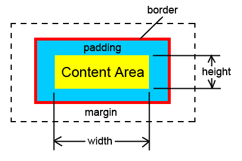
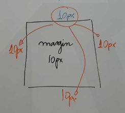
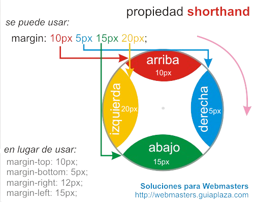

# **[Manual de CSS (Cascading Style Sheets)](https://developer.mozilla.org/en-US/docs/Web/CSS)**

## **[1. Fundamentos de CSS](https://developer.mozilla.org/en-US/docs/Learn/Getting_started_with_the_web/CSS_basics)**

La hoja de estilo en cascada (CSS) se usa para establecer el estilo en páginas web que contienen elementos HTML. Establece el color de fondo, el tamaño de la fuente, la familia de la fuente, el color, etc. de los elementos en las páginas web.

### **Sintaxis, Selectores, Propiedades y Valores:**
La **sintaxis** se refiere a las reglas y estructuras que se utilizan para escribir el código css.

Los **selectores** son las formas en que se identifican los elementos HTML para aplicar los estilos. 

Las **propiedades** son las características que se pueden modificar en un elemento, como el color, font-size y estos definen los estilos que se van a modificar.

Los **valores** son los datos que se asignan a las propiedades para especificar 
el estilo de un elemento.


*[MDN-Docs-CSS-Syntax](https://developer.mozilla.org/en-US/docs/Web/CSS/Syntax)*

### **Comentarios:**
Los comentarios en CSS no afectan el codigo y se utilizan para agregar notas o explicaciones a nuestro código.
```css
/* Esto es un comentario en CSS */
body {
  background-color: #f0f0f0; /* Fondo gris claro */
}
```

### **Cascada:**
La cascada es el concepto que determina qué estilos se colocan sobre otros, priorizando a aquellos que se encuentren más abajo del código, es decir que todo estilo sobreescribe a un estilo anterior lo que significa que el orden de las reglas en css importa, y recordemos que la C de CSS significa cascada.
```css
/* El titulo h1 es rojo por que sobreescribe a los anteriores estilos */
h1 {
  color: red;
}

h1 {
  color: blue;
}
```

### **Herencia:**
La herencia es la capacidad de que los elementos hijos hereden los estilos de sus padres, asi no necesitaria escribir estilos para todo.
```css
/* No es necesario definir un color de texto para los titulos pues son heredados del padre en este caso la etiqueta body */
body {
  color: blue;
}

h1 {
  color: blue; /*No es necesario*/
}
```

### **Especificidad:**
La especificidad es la jerarquía de prioridad que se le da a los selectores y se usa para determinar qué reglas de estilo se aplican a un elemento cuando hay conflicto, y en este caso cuando hay conflictos de estilos el navegador aplica solo el de mayor especificidad.

#### Tipos de especificidad:
Existen 6 tipos de especificidad con su respectivo valor, donde X es la cantidad de estilos que lo contienen. Mira la siguiente imagen:


**Especificidad en selectores** El tema de los selectores ya lo conoces, por lo tanto, los selectores de tipo ID son más específicos que las clases, atributos y pseudoclases. Estas últimas son más específicas que los elementos y pseudoelementos. El selector universal tiene una especificidad de 0.

|  | 
|:--:| 
| *[Specificity Calculator](https://specificity.keegan.st/)* |

**Valor con mayor especificidad:** La palabra reservada !important es un valor de toda propiedad CSS que provee una especificidad de 10000, por lo que se aplicará ante otros estilos. Esto es una mala práctica y no deberías utilizarlo.

```css
/* El parrafo es rojo porque el segundo selector es mas especifico */
.parrafo {
  color: blue;
}

.article .parrafo {
  color: red;
}

h1 {
  color: red !important; /* Esto es una mala práctica y no deberías utilizarlo. */
}

h1 {
  color: blue;
}
```

| Nota: |
| ---------- |
| `Usar !important fuerza que una regla tenga prioridad sobre cualquier otra, aunque esto debe usarse con moderación. En un proyecto se debería evitar los !important y estilos en línea, para trabajar únicamente con la especificidad de los selectores. Sin embargo, debes tener presente que los selectores combinadores suman la especificidad de cada selector básico para obtener la especificidad total de la regla CSS.` |

## **[2. Tipos de CSS](https://developer.mozilla.org/en-US/docs/Learn/CSS/First_steps/How_CSS_is_structured)**

Hay tres formas de implementar o tres tipos de CSS:

1. **CSS en línea** contiene las reglas CSS en la sección del cuerpo del elemento o de la etiqueta. Este tipo de estilo se especifica dentro de una etiqueta HTML usando un atributo de estilo.
    ```html
      <h1 style="color:blue; font-size:50px; text-align:center;">Titulo</h1>
      
      <!-- Nota: Los estilos en línea son las propiedades CSS escritas en el HTML a través de la propiedad style de toda etiqueta. También es una mala práctica y debes evitarlo.-->
    ```
2. **CSS interno o incrustado** se usa cuando un único documento HTML debe tener un estilo único. El conjunto de reglas de CSS debe estar dentro del archivo HTML en la sección principal, es decir, el CSS está incrustado dentro del archivo HTML.
    ```html
      <!DOCTYPE html>
      <html>
          <head>
              <title>CSS interno o inrcustado</title>
              <style>
                  h1 {
                    color: blue;
                    font-size: 50px;
                    text-align:center;
                  }
              </style>
          </head>
          <body>
              <h1>Titulo</h1>
          </body>
      </html> 
    ```

3. **CSS externo** es un archivo CSS separado que solo contiene propiedades de estilo con la ayuda de atributos de etiqueta (por ejemplo, clase, id, encabezado, etc.). La propiedad CSS está escrita en un archivo separado con la extensión .css y se debe vincular al documento HTML mediante la etiqueta de enlace (link).

    ```html
    <!-- index.html -->
    <!DOCTYPE html>
    <html>
        <head>
            <title>CSS externo</title>
            <link rel="stylesheet" href=" style.css"/>
            <!-- La etiqueta link se utiliza para vincular archivos externos a nuestro documento html -->
        </head>
        <body>
            <h1>Titulo</h1>
        </body>
    </html> 
    ```

      **Ejemplo:** El archivo siguiente contiene la propiedad CSS. Este archivo se guarda con la extensión .css

    ```css
    /* style.css */
    h1 {
      color: blue;
      font-size: 50px;
      text-align:center;
    }
    ```

### **Conclusion Prioridad de tipos de CSS:**
CSS en **línea** tiene la prioridad más alta, luego viene **interno / incrustado** seguido de CSS **externo** que tiene la menor prioridad. Se pueden definir múltiples hojas de estilo en una página. Si una etiqueta HTML tiene los tres tipos de estilo en línea, incrustado y externo, se seguirá el orden siguiente.

Como en línea tiene la prioridad más alta, todos los estilos que se definen en las hojas de estilo internas y externas se anulan por los estilos en línea.
Interno o Incrustado ocupa el segundo lugar en la lista de prioridades y anula los estilos en la hoja de estilos externa.
Las hojas de estilo externas tienen la menor prioridad. Si no hay estilos definidos en la hoja de estilo interna o en línea, entonces se aplican reglas de hoja de estilo externas a las etiquetas HTML.

## **[3. Tipos de Selectores (Basicos y Avanzados):](https://developer.mozilla.org/en-US/docs/Web/CSS/CSS_selectors)**

El módulo de selectores CSS define los patrones para seleccionar elementos a los que se les aplica un conjunto de reglas CSS junto con su especificidad. El módulo de selectores CSS nos proporciona más de 60 selectores y cinco combinadores. Otros módulos proporcionan selectores de pseudoclases y pseudoelementos adicionales.

### **Selectores Basicos:**
Seleccionan elementos por nombre de etiqueta, clase o ID.
1. **Selectores de Elemento:** Estos se utilizan para aplicar estilos a todos los **elementos** del mismo tipo. Se definen con el tipo de elemento (`elemento {}`) que deseamos aplicar los estilos.
    ```css
    /* Selector de Elemento */
    h1 {
      color: blue; 
      /* Cambia el color del texto de todos los h1 a azul */
    }
    ```

2. **Selectores de Clase:** Estos se utilizan para aplicar estilos a múltiples elementos. Se definen con un punto (`.`) como prefijo, seguido del nombre de la clase, es decir aplican estilos a elementos con una **clase** específica.
    ```html
    <!-- Clase HTML -->
    <p class="my-class">Texto en azul</p>
    ```
    ```css
    /* Selector de Clase CSS */
    .my-class {
      font-size: 20px; 
      /* Cambia el tamaño del texto de todos los elementos con la clase "class" a 20px */
    }
    ```

3. **Selectores de ID:** Estos se utilizan para aplicar estilos a un solo elemento. Se definen con un símbolo de almohadilla (`#`) como prefijo, seguido del nombre del ID, es decir aplican estilos a un elemento con un **ID** específico.
    ```html
    <p id="my-id">Texto en rojo</p>
    ```
    ```css
    /* Selector de ID */
    #my-id {
      margin: 10px; 
      /* Agrega un margen de 10px alrededor del elemento con el ID "id" */
    }
    ```
### **Selectores Avanzados:** 
Los selectores avanzados permiten aplicar estilos a elementos basados en atributos específicos, estados (como pasar el ratón sobre un enlace) y partes específicas de un elemento (como la primera línea).

1. **Selectores de Atributo:** Estos se utilizan para aplicar estilos a los elementos que coincidan con el valor de un atributo. Se definen con el nombre del selector pasandole entre corchetes el atributo y su valor asi (`selector[atributo="valor"]`).
    ```css
    /* Selector de Atributo */
    input[type="text"] {
      border: 1px solid #ccc;
      /* Agrega un borde gris claro a todos los campos de entrada de tipo texto */
    }
    ```
2. **Selectores de Pseudo-clase:** Estos se utilizan para definir un estado especial de un elemento. Se definen con un símbolo de dos puntos (`:`) como prefijo, seguido del nombre del estado a estilar del elemento.<br>
`:hover` Aplica estilos cuando el usuario pasa el cursor sobre el elemento.<br>
`:active` Aplica estilos cuando un elemento está siendo activado (por ejemplo, un botón que está siendo presionado).<br>
`:focus` Aplica estilos cuando un elemento tiene el foco, como un campo de formulario.<br>
`:nth-child(n)` Aplica estilos a un hijo específico basado en su orden.<br>
`:first-child`, `:last-child` Estas pseudo-clases se usan para aplicar estilos al primer o último hijo de un elemento padre.

    ```css
    /* Selector de Pseudo-clase */
    a:hover {
      color: red; 
      /* Cambia el color de los enlaces a rojo cuando se pasa el ratón sobre ellos */
    }
    ```
3. **Selectores de Pseudo-elemento:** Estos representan partes del árbol de representación que se pueden seleccionar y estilizar. Los pseudo-elementos se utilizan para crear abstracciones sobre el árbol del documento más allá de las proporcionadas por el árbol del documento.

    Los pseudo-elementos tienen como prefijo dos puntos (`::`). Los pseudo-elementos se agregan a los selectores (como en `p::first-line`) para identificar y estilizar estos elementos falsos.
    ```css
    /* Selector de Pseudo-elemento */
    p::first-line {
      font-weight: bold; 
      /* Hace que la primera línea de todos los párrafos sea negrita */
    }
    ```

### **Combinadores:** 
Podemos combinar selectores para aplicar estilos a elementos específicos, es decir permiten seleccionar elementos basados en su relación con otros elementos.

1. **Descendiente:** se representa con un solo carácter de espacio (` `), combina dos selectores de modo que los elementos que coinciden con el segundo selector se seleccionan si tienen un elemento antecesor (padre, padre del padre, padre del padre del padre, etc.) que coincide con el primer selector.
    ```css
    /* Combinador Descendiente */
    div p {
      color: green; 
    /* Cambia el color del texto de los párrafos dentro de un div a verde */
    }
    ```
2. **Hijo:** El operador (`>`) selecciona solo los hijos directos.
    ```css
    /* Combinador Hijo */
    div > p {
      color: blue; 
    /* Cambia el color del texto de los párrafos hijos directos de un div a azul */
    }
    ```
3. **Adyacente:** El operador (`+`) selecciona todos los elementos hermanos que siguen a un elemento específico.
    ```css
    /* Combinador Adyacente */
    h1 + p {
      margin-top: 0; 
    /* Remueve el margen superior del párrafo inmediatamente después de un h1 */
    }
    ```
4. **General de Hermano:** El operador (`~`) selecciona el elemento inmediatamente siguiente a otro.
    ```css
    /* Combinador General de Hermano */
    h1 ~ p {
      color: gray; 
    /* Cambia el color del texto de todos los párrafos que son hermanos de un h1 a gris */
    ```

#### Ejemplos practicos:
```html
<!DOCTYPE html>
<html lang="es">
<head>
  <meta charset="UTF-8">
  <title>Ejemplo de Sintaxis CSS, Selectores (Basicos y Avanzados)</title>
  <link rel="stylesheet" href=" style.css"/>
</head>
<body>
  <!-- index.html -->
  <!-- Selectores Basicos -->
  <h1>Hola Mundo</h1>
  <p class="class">Este es un párrafo con clase.</p>
  <div id="id">Este es un div con ID.</div>

  <!-- Selectores Avanzados: -->

  <!-- Selector de Atributo Exacto -->
  <a href="https://example.com">Enlace a Example</a>
  <a href="https://otro.com">Otro Enlace</a>

  <!-- Selector de Atributo Que Contiene -->
  <a href="https://example.com">Enlace a Example</a>
  <a href="https://sub.example.com">Subdominio de Example</a>
  
  <!-- Selector de Atributo Que Empieza Con -->
  <a href="https://example.com">Enlace Seguro</a>
  <a href="http://example.com">Enlace No Seguro</a>
  
  <!-- Selector de Atributo Que Termina Con -->
  <a href="https://example.com">Enlace .com</a>
  <a href="https://example.org">Enlace .org</a>

  <!-- Selectores de Pseudo-clases -->
  <p>Primer párrafo</p>
  <p>Segundo párrafo</p>
  <p>Tercer párrafo</p>
  <p>Ultimo párrafo</p>
  <a href="#">Pasa el ratón sobre mí</a>

  <!-- Selectores de Pseudo-elementos -->
  <p>Este es un párrafo con pseudo-elemento ::before.</p>
  <p>Este es un párrafo con pseudo-elemento ::after.</p>
  <p>Esta es la primera línea del párrafo, que será en negrita.</p>
  <p>Esta es la primera letra del párrafo, que será más grande y roja.</p>

</body>
</html>
```
```css
/* style.css */
/* Selectores Basicos */
    h1 { color: blue; } /* Cambia el color del título a azul */
    .class { font-size: 20px; } /* Cambia el tamaño del texto a 20px para la clase "class" */
    #id { margin: 10px; } /* Agrega un margen de 10px al elemento con el ID "id" */

    /* Selectores Avanzados: */

    /* Selector de Atributo Exacto */
    a[href="https://example.com"] {
      color: red; /* Cambia el color a rojo para enlaces con href exacto */
    }

    /* Selector de Atributo Que Contiene */
    a[href*="example"] {
      color: green; /* Cambia el color a verde para enlaces que contienen "example" en href */
    }

    /* Selector de Atributo Que Empieza Con */
    a[href^="https"] {
      color: blue; /* Cambia el color a azul para enlaces que empiezan con "https" */
    }

    /* Selector de Atributo Que Terminan Con */
    a[href$=".com"] {
      color: purple; /* Cambia el color a morado para enlaces que terminan con ".com" */
    }

    /* Selectores de Pseudo-clases: */
    p:first-child {
      color: red; /* Cambia el color a rojo para el primer párrafo hijo */
    }

    p:last-child {
      color: blue; /* Cambia el color a azul para el último párrafo hijo */
    }

    p:nth-child(2) {
      color: green; /* Cambia el color a verde para el segundo párrafo hijo */
    }

    a:hover {
      color: orange; /* Cambia el color a naranja cuando se pasa el ratón por encima */
    }

    /* Selectores de Pseudo-elementos: */
    p::before {
      content: "👉 "; /* Añade una flecha antes del contenido del párrafo */
    }
    p::after {
      content: " 🚀"; /* Añade un cohete después del contenido del párrafo */
    }
    p::first-line {
      font-weight: bold; /* Hace la primera línea del párrafo en negrita */
    }
    p::first-letter {
      font-size: 2em; /* Hace la primera letra del párrafo más grande */
      color: red; /* Cambia el color de la primera letra a rojo */
    }
```

## **[4. Modelo de Caja (Box Model)](https://developer.mozilla.org/en-US/docs/Web/CSS/CSS_box_model/Introduction_to_the_CSS_box_model)**

El modelo de la caja define cómo se calculan las dimensiones de un elemento: incluye el `content` (contenido), `padding` (relleno), `border` (borde), `margin` (margen), Altura y Anchura (`height` & `width`).

```css
div {
  margin: 10px;             /* Espacio fuera del borde del div */
  border: 1px solid black;  /* Borde negro de 1px alrededor del div */
  padding: 10px;            /* Espacio dentro del borde del div */
  width: 200px;             /* Ancho del contenido del div */
  height: 100px;            /* Altura del contenido del div */
}
```

|  |
|:--:| 
| *[The CSS Box Model](https://www.unm.edu/~tbeach/IT145/week08/index.html)* |

#### Ejemplo practico
<!-- ### **Sintaxis y Selectores** -->
```html
<!DOCTYPE html>
<html lang="es">
<head>
  <meta charset="UTF-8">
  <title>Ejemplo del Modelo de Caja CSS</title>
  <style>
    .box {
      margin: 20px; /* Espacio fuera del borde del div */
      border: 1px solid black; /* Borde negro de 1px alrededor del div */
      padding: 10px; /* Espacio dentro del borde del div */
      width: 200px; /* Ancho del contenido del div */
      height: 100px; /* Altura del contenido del div */
    }
  </style>
</head>
<body>
  <div class="box">Este es un div con modelo de caja.</div>
</body>
</html>
```

### **La regla del reloj para margins, paddings y borders:** 

La regla del reloj consiste en leer siempre en este orden: `top`, `right`, `bottom`, `left`.

|  |
|:--:| 
| *[La regla del reloj CSS ](https://francescricart.com/la-regla-del-reloj-para-margins-paddings-y-borders/)* |

|  |
|:--:| 
| *[La regla del reloj CSS ](https://francescricart.com/la-regla-del-reloj-para-margins-paddings-y-borders/)* |


### **La facilidad de la propiedad Shorthand en CSS:** 


## **3. Colores y Fondos**

### **Colores**
```html
<!DOCTYPE html>
<html lang="es">
<head>
  <meta charset="UTF-8">
  <title>Ejemplo de Colores CSS</title>
  <style>
    h1 {
      color: rgb(255, 0, 0); /* Rojo usando RGB */
      background-color: #00ff00; /* Verde usando HEX */
      border: 1px solid hsl(240, 100%, 50%); /* Azul usando HSL */
    }
  </style>
</head>
<body>
  <h1>Hola Mundo</h1>
</body>
</html>
```

### **Fondos**
```html
<!DOCTYPE html>
<html lang="es">
<head>
  <meta charset="UTF-8">
  <title>Ejemplo de Fondos CSS</title>
  <style>
    body {
      background-image: url('https://via.placeholder.com/150'); /* Usa una imagen como fondo */
      background-repeat: no-repeat; /* No repite la imagen de fondo */
      background-position: center; /* Coloca la imagen de fondo en el centro */
      background-size: cover; /* Escala la imagen de fondo para cubrir todo el área */
    }
  </style>
</head>
<body>
  <p>Este es un ejemplo de fondo.</p>
</body>
</html>
```

## **4. Texto y Fuentes**

### **Propiedades de Texto**
```html
<!DOCTYPE html>
<html lang="es">
<head>
  <meta charset="UTF-8">
  <title>Ejemplo de Propiedades de Texto CSS</title>
  <style>
    p {
      color: #333; /* Cambia el color del texto a gris oscuro */
      text-align: center; /* Centra el texto */
      letter-spacing: 2px; /* Aumenta el espacio entre las letras */
      word-spacing: 5px; /* Aumenta el espacio entre las palabras */
    }
  </style>
</head>
<body>
  <p>Este es un párrafo con propiedades de texto aplicadas.</p>
</body>
</html>
```

### **Fuentes**
```html
<!DOCTYPE html>
<html lang="es">
<head>
  <meta charset="UTF-8">
  <title>Ejemplo de Fuentes CSS</title>
  <style>
    p {
      font-family: 'Arial', sans-serif; /* Usa Arial o una fuente sans-serif */
      font-size: 16px; /* Cambia el tamaño del texto a 16px */
      font-style: italic; /* Hace que el texto sea cursivo */
      font-weight: bold; /* Hace que el texto sea negrita */
    }
  </style>
</head>
<body>
  <p>Este es un párrafo con fuentes aplicadas.</p>
</body>
</html>
```

## **5. Diseño y Layout**

### **Display**
```html
<!DOCTYPE html>
<html lang="es">
<head>
  <meta charset="UTF-8">
  <title>Ejemplo de Display CSS</title>
  <style>
    .block {
      display: block; /* Hace que el elemento ocupe todo el ancho disponible */
      background-color: lightblue;
      padding: 10px;
      margin-bottom: 10px;
    }

    .inline {
      display: inline; /* Hace que el elemento solo ocupe el espacio necesario */
      background-color: lightgreen;
      padding: 10px;
    }

    .inline-block {
      display: inline-block; /* Combina características de block e inline */
      background-color: lightcoral;
      padding: 10px;
    }
  </style>
</head>
<body>
  <div class="block">Bloque</div>
  <div class="inline">En línea</div>
  <div class="inline-block">En línea-bloque</div>
</body>
</html>
```

### **Posición (Position)**

```html
<!DOCTYPE html>
<html lang="es">
<head>
  <meta charset="UTF-8">
  <title>Ejemplo de Posición CSS</title>
  <style>
    .relative {
      position: relative; /* Posiciona el elemento en relación a su posición normal */
      top: 10px; /* Desplaza el elemento 10px hacia abajo */
      background-color: lightblue;
      padding: 10px;
      margin-bottom: 10px;
    }

    .absolute {
      position: absolute; /* Posiciona el elemento en relación a su contenedor más cercano */
      top: 20px; /* Desplaza el elemento 20px hacia abajo */
      left: 30px; /* Desplaza el elemento 30px hacia la derecha */
      background-color: lightgreen;
      padding: 10px;
    }

    .fixed {
      position: fixed; /* Fija el elemento en una posición relativa a la ventana del navegador */
      bottom: 10px; /* Fija el elemento 10px desde el fondo */
      right: 10px; /* Fija el elemento 10px desde la derecha */
      background-color: lightcoral;
      padding: 10px;
    }

    .sticky {
      position: sticky; /* Hace que el elemento sea "pegajoso" y se quede fijado cuando se desplaza */
      top: 0; /* Fija el elemento en la parte superior */
      background-color: lightyellow;
      padding: 10px;
      margin-bottom: 10px;
    }
  </style>
</head>
<body>
  <div class="relative">Relativa</div>
  <div class="absolute">Absoluta</div>
  <div class="fixed">Fija</div>
  <div class="sticky">Pegajosa</div>
</body>
</html>
```

## **6. Animaciones y Transiciones**

### **Transiciones**
```html
<!DOCTYPE html>
<html lang="es">
<head>
  <meta charset="UTF-8">
  <title>Ejemplo de Transiciones CSS</title>
  <style>
    .button {
      background-color: blue; /* Fondo azul por defecto */
      transition: background-color 0.3s ease; /* Cambia el fondo en 0.3 segundos */
      padding: 10px;
      color: white;
    }

    .button:hover {
      background-color: green; /* Cambia el fondo a verde cuando se pasa el ratón por encima */
    }
  </style>
</head>
<body>
  <button class="button">Pasa el ratón sobre mí</button>
</body>
</html>
```

### **Animaciones**
```html
<!DOCTYPE html>
<html lang="es">
<head>
  <meta charset="UTF-8">
  <title>Ejemplo de Animaciones CSS</title>
  <style>
    @keyframes example {
      from { background-color: red; } /* Comienza con un fondo rojo */
      to { background-color: yellow; } /* Termina con un fondo amarillo */
    }

    .box {
      animation: example 5s infinite; /* Aplica la animación "example" durante 5 segundos, infinitamente */
      width: 100px;
      height: 100px;
      background-color: red;
    }
  </style>
</head>
<body>
  <div class="box"></div>
</body>
</html>
```

## **7. Medios Responsivos**

### **Media Queries**
```html
<!DOCTYPE html>
<html lang="es">
<head>
  <meta charset="UTF-8">
  <title>Ejemplo de Media Queries CSS</title>
  <style>
    body {
      background-color: lightblue; /* Fondo azul claro por defecto */
    }

    @media (max-width: 600px) {
      body {
        background-color: lightgreen; /* Cambia el fondo a verde claro en pantallas menores a 600px */
      }
    }
  </style>
</head>
<body>
  <p>Redimensiona la ventana para ver el cambio de fondo.</p>
</body>
</html>
```

### **Unidades Responsivas**
```html
<!DOCTYPE html>
<html lang="es">
<head>
  <meta charset="UTF-8">
  <title>Ejemplo de Unidades Responsivas CSS</title>
  <style>
    .container {
      width: 50%; /* Ancho del 50% del contenedor padre */
      padding: 2em; /* Relleno de 2 em (relativo al tamaño de la fuente) */
      margin: 1rem; /* Margen de 1 rem (relativo al tamaño de la raíz) */
      height: 100vh; /* Altura del 100% de la ventana del navegador */
      background-color: lightcoral;
    }
  </style>
</head>
<body>
  <div class="container">Este es un contenedor responsivo.</div>
</body>
</html>
```

## **8. Buenas Prácticas**

### **Organización del Código**
```html
<!DOCTYPE html>
<html lang="es">
<head>
  <meta charset="UTF-8">
  <title>Ejemplo de Organización del Código CSS</title>
  <style>
    /* Comentarios */
    .header {
      font-size: 24px; /* Tamaño de fuente */
      color: #333; /* Color del texto */
    }

    /* Formato */
    .main-content {
      padding: 20px; /* Relleno de 20px */
      margin: 10px; /* Margen de 10px */
      background-color: lightblue;
    }
  </style>
</head>
<body>
  <div class="header">Encabezado</div>
  <div class="main-content">Contenido principal</div>
</body>
</html>
```

### **Mantenimiento**
```html
<!DOCTYPE html>
<html lang="es">
<head>
  <meta charset="UTF-8">
  <title>Ejemplo de Mantenimiento CSS</title>
  <style>
    /* Nombres de Clases Significativos */
    .navbar {
      background-color: #fff; /* Fondo blanco */
      padding: 10px;
    }

    /* Reutilización de Estilos */
    .button {
      padding: 10px 20px; /* Relleno de 10px y 20px */
      border: none; /* Sin borde */
      background-color: lightgreen;
    }
  </style>
</head>
<body>
  <div class="navbar">Navegación</div>
  <button class="button">Botón</button>
</body>
</html>
```

### **Preprocesadores**
```html
<!DOCTYPE html>
<html lang="es">
<head>
  <meta charset="UTF-8">
  <title>Ejemplo de Preprocesadores CSS</title>
  <style>
    .button {
      background-color: #333; /* Usa la variable de color primario */
      padding: 10px 20px; /* Relleno de 10px y 20px */
      color: white;
    }
  </style>
</head>
<body>
  <button class="button">Botón con Sass</button>
</body>
</html>
```